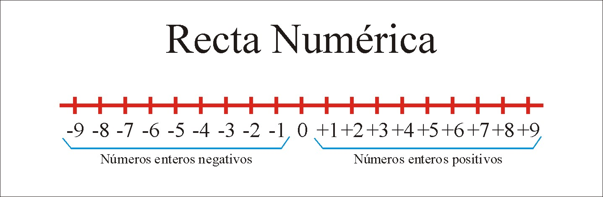
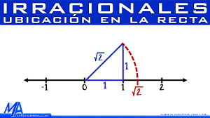

# Universos Numéricos y Operaciones Fundamentales
## Matemáticas – Grado 11° – Preparación ICFES
(Basado en Saberes 11 – CEINFES)

---

## 1. Sistemas numéricos

Las matemáticas organizan los números en **conjuntos numéricos**, definidos por propiedades que determinan qué operaciones son posibles y cómo se comportan los resultados. Esta clasificación permite comprender la estructura de los números, comparar magnitudes y modelar situaciones reales con precisión.

---

### 1.1 Números naturales (ℕ)

El conjunto de los números naturales está formado por los números utilizados para contar elementos. Es el primer conjunto que el ser humano desarrolló por necesidad práctica.

$$
\mathbb{N} = \{1, 2, 3, 4, \dots\}
$$

**Propiedades y características:**
- **Cerrados bajo suma y multiplicación:** El resultado de sumar o multiplicar dos naturales siempre es otro natural.
- **Sin elementos negativos ni decimales:** Representan unidades enteras y positivas.
- **El debate del CERO:** En algunos contextos (como la teoría de conjuntos), se incluye al 0 en $\mathbb{N}$. Para efectos del ICFES, suele trabajarse desde el 1, llamando "Naturales extendidos" ( $\mathbb{N}_0$ ) cuando se incluye el cero.

---

### 1.2 Números enteros (ℤ)

Surgen ante la necesidad de representar "deudas", temperaturas bajo cero o posiciones debajo del nivel del mar. Incluyen los naturales, el cero y sus opuestos (negativos):

$$
\mathbb{Z} = \{\dots, -3, -2, -1, 0, 1, 2, 3, \dots\}
$$

---

### 1.3 Números racionales (ℚ)

Son aquellos que pueden escribirse como el cociente de dos números enteros, donde el divisor es distinto de cero. Representan "partes de un todo".

$$
\mathbb{Q} = \left\lbrace \frac{a}{b} \mid a,b \in \mathbb{Z}, b \neq 0 \right\rbrace
$$

**Representación decimal:**
- **Decimal finita:** (Ej: $\frac{1}{2} = 0.5$, $\frac{3}{4} = 0.75$).
- **Decimal infinita periódica:** (Ej: $\frac{1}{3} = 0.333\dots$, $\frac{22}{7} = 3.142857\dots$).

**Propiedad de densidad:**  
Entre dos números racionales distintos siempre existe otro número racional. Esto significa que no hay un "siguiente" racional inmediato.

---

### 1.4 Números irracionales ($\mathbb{I}$)

Los números irracionales son aquellos que **no pueden expresarse como fracción de enteros**. Poseen cifras decimales infinitas que **no siguen un patrón o periodo**.

**Ejemplos clásicos:**
- **Constantes geométricas:** $\pi$ (relación circunferencia/diámetro) $\approx 3.14159\dots$
- **Número áureo ($\phi$):** $\frac{1+\sqrt{5}}{2} \approx 1.618\dots$ (frecuente en arte y naturaleza).
- **Raíces no exactas:** $\sqrt{2}, \sqrt{3}, \sqrt{5}, \sqrt[3]{7}$.

---

#### Ejemplo fundamental: la raíz cuadrada de 2

Considérese un cuadrado de lado 1. Según el **Teorema de Pitágoras**, la diagonal ($d$) cumple:

$$
d^2 = 1^2 + 1^2 = 2 \implies d = \sqrt{2}
$$

Al intentar expresar $\sqrt{2}$ como fracción, se descubre que es imposible, lo que lo clasifica como irracional.

---

### 1.5 Números reales (ℝ)

El conjunto de los números reales es la unión de los racionales y los irracionales:

$$
\mathbb{R} = \mathbb{Q} \cup \mathbb{I}
$$

Todo número que usamos habitualmente en el colegio (excepto las raíces de números negativos) pertenece a los Reales. En la recta numérica, **los Reales la completan totalmente** (no dejan "huecos").

---

## 2. La recta numérica

La **recta numérica** es una representación lineal donde a cada punto le corresponde un único número real. Es la herramienta principal para entender el **orden** y la **distancia**.

**Funciones principales de la recta numérica:**
- Comparar números.
- Representar intervalos.
- Visualizar soluciones de ecuaciones.
- Ubicar números irracionales.
- Interpretar desigualdades.

---

### 2.1 Métodos generales para ubicar números irracionales en la recta numérica

Aunque los números irracionales no pueden escribirse como fracción ni como decimal exacto, **sí pueden ubicarse con precisión** en la recta numérica mediante distintos métodos generales.

---

#### Método 1: Aproximación decimal

Todo número irracional puede aproximarse mediante números racionales.

Ejemplo general:

$\sqrt{5} \approx 2.236067...$

Esto permite ubicarlo entre 2.23 y 2.24 en la recta.

Este método es útil cuando se trabaja con escalas numéricas o estimaciones.

---

#### Método 2: Encaje entre racionales

Se localiza el irracional determinando dos números racionales entre los cuales se encuentra.

Ejemplo:

$2^2=4<5<9=3^2\Rightarrow\sqrt{5}\in(2,3)$

Este procedimiento se puede refinar utilizando decimales o fracciones.

---

#### Método 3: Construcción geométrica (Precisión exacta)

Este método utiliza el **Teorema de Pitágoras** ($a^2 + b^2 = c^2$) para construir segmentos cuya longitud sea exactamente igual a la raíz cuadrada de un número. Es el método más elegante ya que no depende de aproximaciones decimales.

**Instrucciones paso a paso:**

1.  **Identificar los catetos:** Debes encontrar dos números (preferiblemente enteros o raíces ya conocidas) cuyos cuadrados sumados den como resultado el número dentro de la raíz que deseas graficar ($n$).
    *   Para $\sqrt{2}$: Usa catetos $1$ y $1$ (pues $1^2 + 1^2 = 2$).
    *   Para $\sqrt{5}$: Usa catetos $2$ y $1$ (pues $2^2 + 1^2 = 5$).
    *   Para $\sqrt{3}$: Usa catetos $\sqrt{2}$ (ya graficado) y $1$ (pues $(\sqrt{2})^2 + 1^2 = 3$).

2.  **Construir el triángulo:**
    *   Sobre la recta numérica, dibuja una base desde el $0$ hasta el valor del primer cateto.
    *   En ese punto, levanta una línea perpendicular (hacia arriba) con la longitud del segundo cateto.

3.  **Trazar la hipotenusa:** Une el origen ($0$) con el extremo superior de la línea perpendicular. La longitud de esta diagonal es exactamente el número irracional buscado.

4.  **Marcar sobre la recta (El Compás):**
    *   Apoya la punta del **compás** en el punto $0$.
    *   Abre el compás hasta el extremo de la hipotenusa.
    *   Traza un arco de circunferencia hacia abajo hasta que toque la recta numérica. El punto de contacto es la ubicación exacta del número irracional.

---

##### Ejemplo detallado: Ubicación de \(\sqrt{2}\) y \(\sqrt{3}\)

*   **Para $\sqrt{2}$:**
    1. Base de longitud 1 sobre el eje X.
    2. Altura de longitud 1 perpendicular.
    3. Hipotenusa = $\sqrt{1^2 + 1^2} = \sqrt{2}$.
    4. El arco marca el punto aproximadamente en $1.41$.

*   **Para $\sqrt{3}$ (Efecto caracol):**
    1. Base de longitud $\sqrt{2}$ (usando el punto que acabamos de marcar).
    2. Altura de longitud 1 perpendicular.
    3. Hipotenusa = $\sqrt{(\sqrt{2})^2 + 1^2} = \sqrt{2+1} = \sqrt{3}$.
    4. El arco marca el punto aproximadamente en $1.73$.

---

## 3. Intervalos numéricos

Un **intervalo** es un subconjunto de los números reales que representa un segmento de la recta numérica. Se define mediante sus extremos $a$ y $b$.

### Tipos de intervalos y representación

| Tipo | Notación | Conjunto | Representación Gráfica |
| :--- | :--- | :--- | :--- |
| **Cerrado** | $[a, b]$ | $\{x \in \mathbb{R} \mid a \le x \le b\}$ | Puntos rellenos en $a$ y $b$. |
| **Abierto** | $(a, b)$ | $\{x \in \mathbb{R} \mid a < x < b\}$ | Puntos vacíos en $a$ y $b$. |
| **Semiabierto** | $[a, b)$ | $\{x \in \mathbb{R} \mid a \le x < b\}$ | Relleno en $a$, vacío en $b$. |
| **Infinito** | $(a, \infty)$ | $\{x \in \mathbb{R} \mid x > a\}$ | Flecha hacia la derecha. |
| **Infinito** | $(-\infty, b]$ | $\{x \in \mathbb{R} \mid x \le b\}$ | Flecha hacia la izquierda. |

---

## 4. Teoría de conjuntos y notación

El lenguaje de conjuntos es universal en matemáticas. Los conjuntos numéricos vistos anteriormente ( $\mathbb{N, Z, Q}$... ) siguen estas reglas.

### 4.1 Operaciones entre conjuntos

- **Unión ($A \cup B$):** Elementos que están en $A$ **o** en $B$. (Todo lo que hay en ambos).
- **Intersección ($A \cap B$):** Elementos que están en $A$ **y** en $B$. (Lo común).
- **Diferencia ($A - B$):** Elementos que están en $A$ pero **no** en $B$.
- **Complemento ($A^c$):** Todo lo que no está en el conjunto $A$ (dentro de un universo $U$).

### 4.2 Símbolos frecuentemente usados
- $\in$ : Pertenece a...
- $\notin$ : No pertenece a...
- $\subset$ : Es subconjunto de... (está contenido en)
- $\emptyset$ : Conjunto vacío.
- $\forall$ : Para todo...
- $\exists$ : Existe un...

## 5. Razones y proporciones

### 5.1 Razón

Una **razón** es la comparación entre dos magnitudes mediante una división. Si se comparan dos cantidades \(a\) y \(b\), la razón entre ellas se expresa como:

$$
\frac{a}{b}
$$

Esta expresión se lee como *“la razón de \(a\) a \(b\)”*.

Las razones permiten comparar tamaños, cantidades, precios, tiempos o cualquier otra magnitud medible.

---

### 5.2 Proporción

Una **proporción** es la igualdad entre dos razones:

$$
\frac{a}{b} = \frac{c}{d}
$$

Se lee como *“\(a\) es a \(b\) como \(c\) es a \(d\)”*.

---

### 5.3 Magnitudes Directamente Proporcionales

Dos magnitudes son **directamente proporcionales** si al aumentar una, la otra también aumenta en la misma proporción (o ambas disminuyen).

**Ejemplo:** Si 3 cuadernos cuestan \$12.000, ¿cuánto cuestan 5 cuadernos?
- Relación: $\frac{3}{12000} = \frac{5}{x}$
- Solución: $3x = 60000 \implies x = 20000$.

---

### 5.4 Magnitudes Inversamente Proporcionales

Dos magnitudes son **inversamente proporcionales** si al aumentar una, la otra disminuye en la misma proporción. En estos casos, el **producto** de las magnitudes es constante.

**Situación contextualizada:**
En una obra, 4 trabajadores realizan una labor en 6 días. ¿Cuántos días tardarán 6 trabajadores en realizar el mismo trabajo?

**Planteamiento (Inversa):**
Como hay más trabajadores, el tiempo **debe ser menor**. No se igualan las fracciones directamente, sino los productos:

$\text{Trabajadores}_1 \cdot \text{Días}_1 = \text{Trabajadores}_2 \cdot \text{Días}_2$

$4 \cdot 6 = 6 \cdot x$

**Resolución:**

$24 = 6x \implies x = \frac{24}{6} = 4$

**Conclusión:**
6 trabajadores realizarán el trabajo en **4 días**.

---

### 5.5 Aplicación ICFES: Porcentajes
Un porcentaje es una razón cuyo denominador es 100.
**Ejemplo rápido:** El 15% de descuento en un producto de \$80.000 es:

$80000 \cdot \frac{15}{100} = 12000$

Precio final = \$68.000.

---

## 6. Expresiones algebraicas y modelación

### 6.1 Anatomía de un término algebraico

Un término es la unidad mínima de una expresión. Se compone de:
- **Signo:** Indica si es positivo o negativo.
- **Coeficiente:** El número que multiplica a las letras.
- **Factor literal (Variables):** Las letras que representan valores desconocidos.
- **Grado:** El exponente de la variable (o la suma de los exponentes de las letras).

**Ejemplo:** En $-5x^2$:
- Signo: negativo $(-)$
- Coeficiente: $5$
- Variable: $x$
- Grado: $2$

---

### 6.2 Clasificación por número de términos

1.  **Monomio:** Un solo término ($3x^2$).
2.  **Binomio:** Dos términos conectados por suma o resta ($x + y$).
3.  **Trinomio:** Tres términos ($ax^2 + bx + c$).
4.  **Polinomio:** Cuatro o más términos.

---

### 6.3 Modelación de situaciones reales

La modelación consiste en traducir el lenguaje común al lenguaje matemático.

**Diccionario básico de traducción:**
- *El doble de un número:* $2x$
- *Un número aumentado en 5:* $x + 5$
- *El cuadrado de la suma de dos números:* $(x+y)^2$
- *La diferencia de los cuadrados de dos números:* $x^2 - y^2$

---

**Ejemplo de modelación compleja:**

Una empresa de mensajería cobra una base de \$10.000 por envío, más \$1.500 por cada kilogramo de peso ($k$) y \$500 por cada kilómetro recorrido ($d$).

**Expresión algebraica del costo total $C$:**

$C(k, d) = 10000 + 1500k + 500d$

Si un paquete pesa 5 kg y viaja 20 km:

$C = 10000 + 1500(5) + 500(20) = 10000 + 7500 + 10000 = \$27.500$

---

## 7. Sucesiones y Series numéricas

### 7.1 Conceptos clave

- **Sucesión:** Función cuyo dominio son los enteros positivos $\{1, 2, 3, \dots\}$. Se denota como $\{a_n\}$.
- **Término General ($a_n$):** La "fórmula" que permite hallar cualquier término según su posición $n$.
- **Serie:** El resultado de sumar los términos de una sucesión ($S_n$).

---

### 7.2 Progresiones Aritméticas (P.A.)

La diferencia entre un término y el anterior es constante ($d$).

- **Fórmula del término $n$-ésimo:**
  $$a_n = a_1 + (n-1)d$$
- **Fórmula de la suma de los $n$ primeros términos:**
  $$S_n = \frac{n(a_1 + a_n)}{2}$$

**Ejemplo:** En $5, 8, 11, 14, \dots$ ($a_1 = 5, d = 3$).
- Hallar el término 10: $a_{10} = 5 + (10-1)3 = 5 + 27 = 32$.
- Suma de los 10 primeros: $S_{10} = \frac{10(5 + 32)}{2} = 5(37) = 185$.

---

### 7.3 Progresiones Geométricas (P.G.)

Cada término se obtiene multiplicando el anterior por una razón constante ($r$).

- **Fórmula del término $n$-ésimo:**
  $$a_n = a_1 \cdot r^{n-1}$$
- **Fórmula de la suma de los $n$ primeros términos:**
  $$S_n = \frac{a_1(r^n - 1)}{r - 1} \quad (r \neq 1)$$

**Ejemplo:** En $3, 6, 12, 24, \dots$ ($a_1 = 3, r = 2$).
- Hallar el término 5: $a_5 = 3 \cdot 2^{5-1} = 3 \cdot 16 = 48$.
- Suma de los 5 primeros: $S_5 = \frac{3(2^5 - 1)}{2 - 1} = 3(31) = 93$.

## 8. Potenciación

La **potenciación** es una operación que simplifica la multiplicación repetida de un mismo número.

### 8.1 Elementos de la potencia
En la expresión **\(a^n = P\)**:
- **\(a\)**: **Base** (el número que se multiplica).
- **\(n\)**: **Exponente** (indica cuántas veces se multiplica la base).
- **\(P\)**: **Potencia** (el resultado final).

---

### 8.2 Propiedades fundamentales de la Potenciación

| Propiedad | Definición | Ejemplo |
| :--- | :--- | :--- |
| **Producto de igual base** | $a^m \cdot a^n = a^{m+n}$ | $2^3 \cdot 2^2 = 2^5 = 32$ |
| **Cociente de igual base** | $\frac{a^m}{a^n} = a^{m-n}$ | $\frac{5^7}{5^5} = 5^2 = 25$ |
| **Potencia de una potencia** | $(a^m)^n = a^{m \cdot n}$ | $(3^2)^3 = 3^6 = 729$ |
| **Potencia de un producto** | $(a \cdot b)^n = a^n \cdot b^n$ | $(2 \cdot 5)^3 = 2^3 \cdot 5^3 = 1000$ |
| **Potencia de un cociente** | $(\frac{a}{b})^n = \frac{a^n}{b^n}$ | $(\frac{2}{3})^2 = \frac{4}{9}$ |
| **Exponente cero** | $a^0 = 1 \quad (a \neq 0)$ | $1527^0 = 1$ |
| **Exponente negativo** | $a^{-n} = \frac{1}{a^n}$ | $4^{-2} = \frac{1}{4^2} = \frac{1}{16}$ |

---

## 9. Radicación

La **radicación** busca encontrar la base de una potencia cuando conocemos el exponente (índice) y el resultado (radicando).

### 9.1 Elementos de la raíz
En la expresión **$\sqrt[n]{a} = b$**:
- **\(n\)**: **Índice** (grado de la raíz). Si no aparece, es 2 (raíz cuadrada).
- **$\sqrt{}$**: **Radical** (el símbolo).
- **\(a\)**: **Radicando** o Cantidad Subradical.
- **\(b\)**: **Raíz** (el resultado).

---

### 9.2 Propiedades de la Radicación

| Propiedad | Definición | Ejemplo |
| :--- | :--- | :--- |
| **Exponente fraccionario** | $\sqrt[n]{a^m} = a^{\frac{m}{n}}$ | $\sqrt[3]{x^6} = x^{6/3} = x^2$ |
| **Raíz de un producto** | $\sqrt[n]{a \cdot b} = \sqrt[n]{a} \cdot \sqrt[n]{b}$ | $\sqrt{36 \cdot 100} = 6 \cdot 10 = 60$ |
| **Raíz de un cociente** | $\sqrt[n]{\frac{a}{b}} = \frac{\sqrt[n]{a}}{\sqrt[n]{b}}$ | $\sqrt[3]{\frac{8}{27}} = \frac{2}{3}$ |
| **Raíz de una raíz** | $\sqrt[m]{\sqrt[n]{a}} = \sqrt[m \cdot n]{a}$ | $\sqrt{\sqrt[3]{64}} = \sqrt[6]{64} = 2$ |
| **Raíz de una potencia** | $\sqrt[n]{a^n} = a$ (si $n$ impar) | $\sqrt[3]{5^3} = 5$ |
| **Raíz de potencia par** | $\sqrt[n]{a^n} = \|a\|$ (si $n$ par) | $\sqrt{(-3)^2} = \|-3\| = 3$ |

---

## 10. Logaritmación

El **logaritmo** responde a la pregunta: *¿A qué exponente debo elevar la base para obtener este número?*

### 10.1 Elementos del logaritmo
En la expresión **\(\log_b a = x\)**:
- **\(b\)**: **Base** del logaritmo ($b > 0, b \neq 1$).
- **\(a\)**: **Argumento** (debe ser mayor a 0).
- **\(x\)**: **Logaritmo** (el resultado/exponente).

---

### 10.2 Propiedades de los logaritmos

| Propiedad | Definición | Ejemplo |
| :--- | :--- | :--- |
| **Log de un producto** | $\log_b(M \cdot N) = \log_b M + \log_b N$ | $\log_2(8 \cdot 4) = 3 + 2 = 5$ |
| **Log de un cociente** | $\log_b(\frac{M}{N}) = \log_b M - \log_b N$ | $\log_{10}(1000/10) = 3 - 1 = 2$ |
| **Log de una potencia** | $\log_b (a^n) = n \cdot \log_b a$ | $\log_3 (9^4) = 4 \cdot \log_3 9 = 4 \cdot 2 = 8$ |
| **Log de la unidad** | $\log_b 1 = 0$ | $\log_{5} 1 = 0$ |
| **Log de la base** | $\log_b b = 1$ | $\log_{e} e = 1$ |
| **Cambio de base** | $\log_b a = \frac{\log_c a}{\log_c b}$ | $\log_4 16 = \frac{\log_2 16}{\log_2 4} = \frac{4}{2} = 2$ |
| **Log de una raíz** | $\log_b \sqrt[n]{a} = \frac{1}{n} \log_b a$ | $\log_2 \sqrt{8} = \frac{1}{2} \cdot 3 = 1.5$ |

---

## 11. Relación entre las tres operaciones

Estas tres operaciones son caras de la misma moneda. Se pueden ver como una estructura circular:

$$
\text{Si } 2^3 = 8 \text{ entonces:}
$$
- **Potenciación:** $2^3 = ?$ (Busca la potencia: 8).
- **Radicación:** $\sqrt[3]{8} = ?$ (Busca la base: 2).
- **Logaritmación:** $\log_2 8 = ?$ (Busca el exponente: 3).

| Operación | Pregunta clave | Relación |
|---------|----------|----------|
| Potenciación | ¿Cuál es el resultado? | $b^x = a$ |
| Radicación | ¿Cuál es la base? | $\sqrt[x]{a} = b$ |
| Logaritmación | ¿Cuál es el exponente? | $\log_b a = x$ |

---